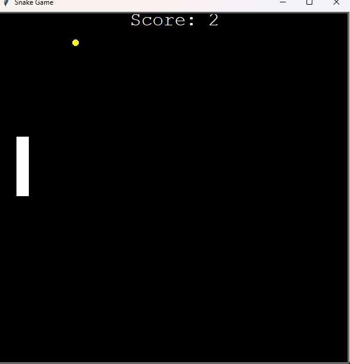

# Python Turtle Snake Game

Welcome to the Python Turtle Snake Game! This project is a modern recreation of the classic Snake game, developed using Python and the Turtle graphics library. Navigate your snake to eat food and grow longer while avoiding collisions with the walls and your own tail.

## Table of Contents
- [Introduction](#introduction)
- [Features](#features)
- [Installation](#installation)
- [How to Play](#how-to-play)
- [Screenshots](#screenshots)
- [Contributing](#contributing)
- [License](#license)
- [Contact](#contact)

## Introduction
This project demonstrates how to use Python's Turtle graphics library to create a simple yet engaging game. It serves as an excellent example for beginners learning Python and game development.

## Features
- Classic Snake gameplay
- Simple and intuitive controls
- Colorful graphics using Turtle
- Score tracking

## Installation
To run this game on your local machine, follow these steps:

1. **Clone the Repository**:
    ```bash
    git clone https://github.com/1GW3M1CH3LL3/snakegame.git
    cd snakegame
    ```

2. **Set Up the Environment**:
    Ensure you have Python installed. You can download it from [python.org](https://www.python.org/).

3. **Install Required Libraries**:
    The game uses the Turtle library, which is included with Python. If you need to install it separately, run:
    ```bash
    pip install PythonTurtle
    ```

4. **Run the Game**:
    Execute the following command to start the game:
    ```bash
    python snake_game.py
    ```

## How to Play
- Use the arrow keys to move the snake:
  - **Up Arrow**: Move up
  - **Down Arrow**: Move down
  - **Left Arrow**: Move left
  - **Right Arrow**: Move right
- The objective is to eat the food on the screen, making the snake grow longer.
- Avoid running into the walls or the snake's tail.

## Screenshots


## Contributing
Contributions are welcome! Feel free to create an issue or submit a pull request if you have suggestions for improvements or new features.

## License
This project is licensed under the MIT License. See the [LICENSE](LICENSE) file for details.

## Contact
If you have any questions or feedback, feel free to contact me at:

- **GitHub**: [1GW3M1CH3LL3](https://github.com/1GW3M1CH3LL3)
- **Email**: [adaoraigwe400@gmail.com]
- **LinkedIn**: [https://www.linkedin.com/in/adaoraigwe/]

---
